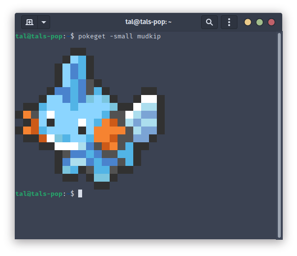

pokeget
===

Pokeget is a bash script you can use to display cool sprites of pokemon in your terminal.
## Examples



## Installation
*Note: the install commands should be exactly the same for updating.*
You can install pokeget by doing these commands:
```
wget https://raw.githubusercontent.com/talwat/pokeget/main/pokeget
chmod +x pokeget
mv pokeget ~/.local/bin
```
Which will preform a local installaion, or to install for all users do:
```
wget https://raw.githubusercontent.com/talwat/pokeget/main/pokeget
chmod +x pokeget
sudo mv pokeget /usr/bin
```

## Sources
All sprites are from [Pokemon Reborn](https://www.rebornevo.com/) *(A pokemon fan game)*.

However, all the original sprites and character designs are made by Game Freak.

## Usage
The help command is `pokeget help`, if you need to get a quick reminder.

You can do `pokeget <pokemon national dex id>` to display the sprite.

If you want a list of flags, you can look at [HELP.md](HELP.md).

## Dependencies
To run pokeget you will need bash and unzip.

To install pokeget, you might need wget if you dont clone the repository and instead use the install instructions.

All dependencies are usually installed by default on most linux distros, as this script is designed to run on linux.

## Known issues
During testing, some of the unicode symbols have displayed incorrectly, this is still being worked on.

This may only occur with zsh, as using it with other shells has proven more stable.