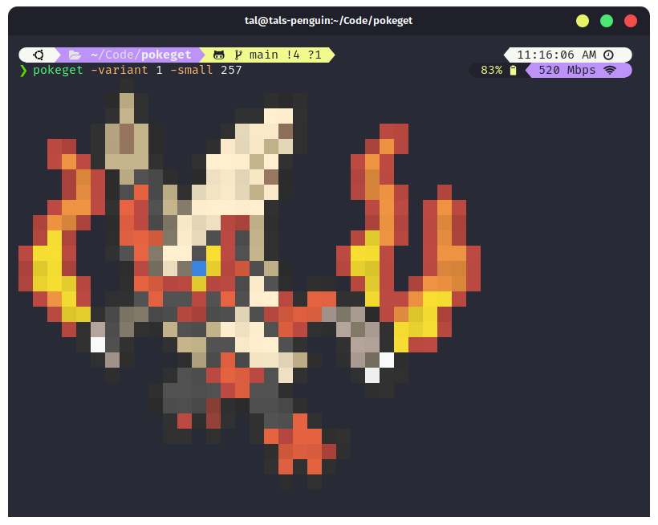
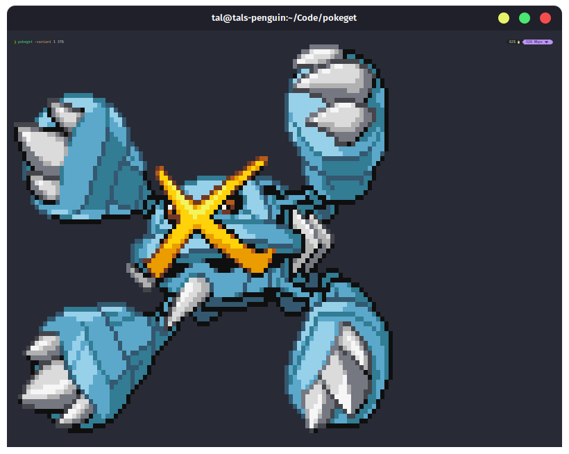

# pokeget

[](https://github.com/talwat/pokeget/stargazers)
[](https://github.com/talwat/pokeget)


Pokeget is a bash script you can use to display cool sprites of pokemon in your terminal.

## Info

Pokeget has support for all pokemon up to gen 8 *including gen 8* and is written in bash.

Pokeget has only needs basic dependencies usually preinstalled in GNU/Linux systems.

## Examples




## Installation

*Note: the install commands should be exactly the same for updating, and repairing pokeget.*
You can install pokeget by running the install script:

```bash
curl https://raw.githubusercontent.com/talwat/pokeget/main/scripts/install.sh | bash
```

Which will preform a local installation, or to install for all users do:

```bash
sudo curl https://raw.githubusercontent.com/talwat/pokeget/main/scripts/install.sh | bash
```

When updating, make sure you do the same command you did when installing to avoid having multiple copies of pokeget.

## Uninstallation

Currently there is no uninstall script, however to remove pokeget simply do:

```bash
rm ~/.local/bin/pokeget
rm -rf ~/.config/pokeget
```

in your shell to remove a local installation, and to remove a system wide installation do:

```bash
sudo rm -rf /usr/bi/pokeget
```

*Keep in mind if you did a **system wide installation** all users who used pokeget will have to delete their pokeget config files manually*

The pokeget configuration files are located in `~/.config/pokeget` so keep that in mind.

## Sources

All sprites are taken from [Pokemon Reborn](https://www.rebornevo.com/) *(A pokemon fan game)*.

However, the original sprites and character designs are made by Game Freak.

The sprites have been converted into .txt files by me, so feel free to use them in other projects.

## Usage

The help command is `pokeget help`, if you need to get a quick reminder.

You can do `pokeget <pokemon national dex id>` to display the sprite.

If you want a list of flags, you can look at [USAGE.md](USAGE.md).

## Dependencies

To run pokeget you will need bash and unzip.

To install pokeget, you might need wget if you don't clone the repository and instead use the install instructions.

All dependencies are usually installed by default on most Linux distros, as this script is designed to run on GNU/Linux.

## Known issues

During testing, some of the unicode symbols have displayed incorrectly, this is still being worked on.
